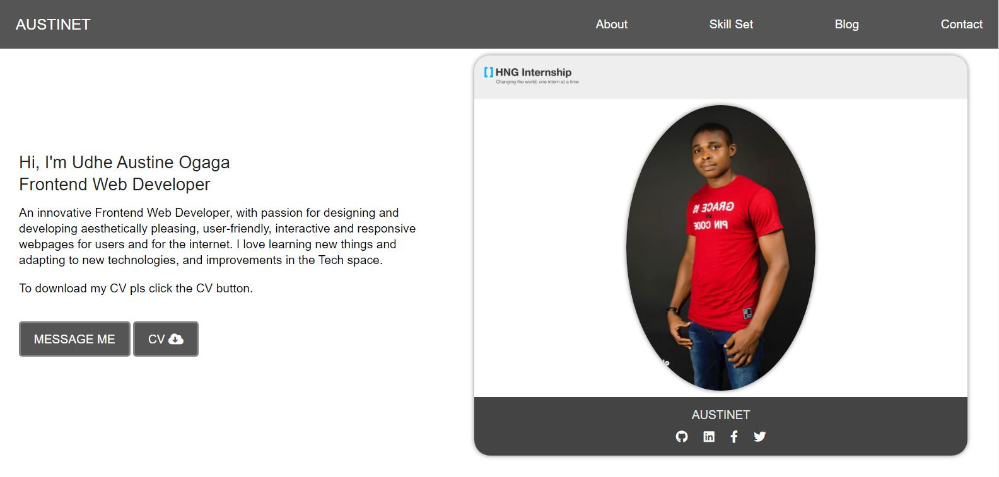
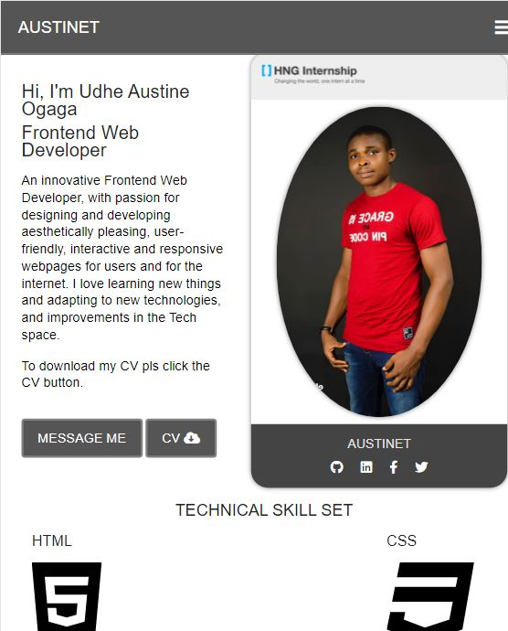
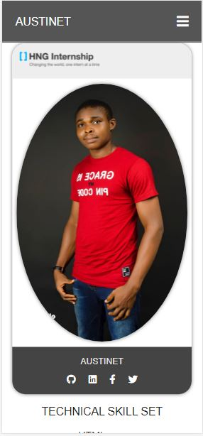

# resume

# HNG Internship - Resume Website

## Table of contents

- [Overview](#overview)
  - [The challenge](#the-challenge)
  - [Screenshot](#screenshot)
  - [Links](#links)
- [My process](#my-process)
  - [Built with](#built-with)
  - [Continued development](#continued-development)
  - [Useful resources](#useful-resources)
- [Author](#author)
- [Acknowledgments](#acknowledgments)

## Overview

### The challenge

Users should be able to:
- View the resume page
- View the optimal layout for the site depending on their device's screen size

### Screenshot

### Links

- Solution URL: [Solution URL here](https://github.com/Austinet/resume.git)
- Live Site URL: [Live site](https://Austinet.github.io/resume/)
- Link to Name Printer in JavaScript Repo [Name Print Repo](https://github.com/Austinet/resume/blob/00a003cae027ffbdd7fae97b9964d7b2dec80a10/Name-In-JS/index.html)

- Name Printer Live Site URL: [Name Print Live](https://Austinet.github.io/resume/Name-In-JS/)
## My process

### Built with

- Semantic HTML5 markup
- CSS custom properties
- CSS Flexbox
- CSS Grid
- Desktop-first workflow
- Visual Studio Code
- Vanilla Javascript

### Continued development

Keep taking up projects and keep improving, keep networking.

### Useful resources

- [ Youtube](https://www.Youtube.com) 
- [Google  ](https://www.Google.com) 

## Author

- Frontend Mentor - [@austinet](https://www.frontendmentor.io/profile/austinet)
- Twitter - [@udhe.austine](https://www.twitter.com/udhe.austine)
- Linkedin - [Udhe Austine Ogaga](https://www.linkedin.com/in/udhe-austine-ogaga-25961820b)
- Email  - [austinetsplendour](austinetsplendour@gmail.com)

## Acknowledgments

I will like to acknowledge God for giving me the grace to keep up with the good work.And also the Zuri team at HNG Internship. And also Google, Youtube and ctrl+z lol.
